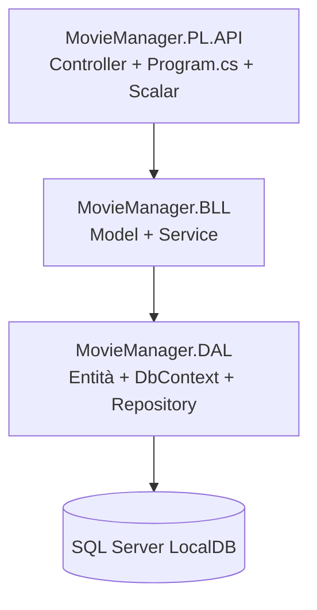
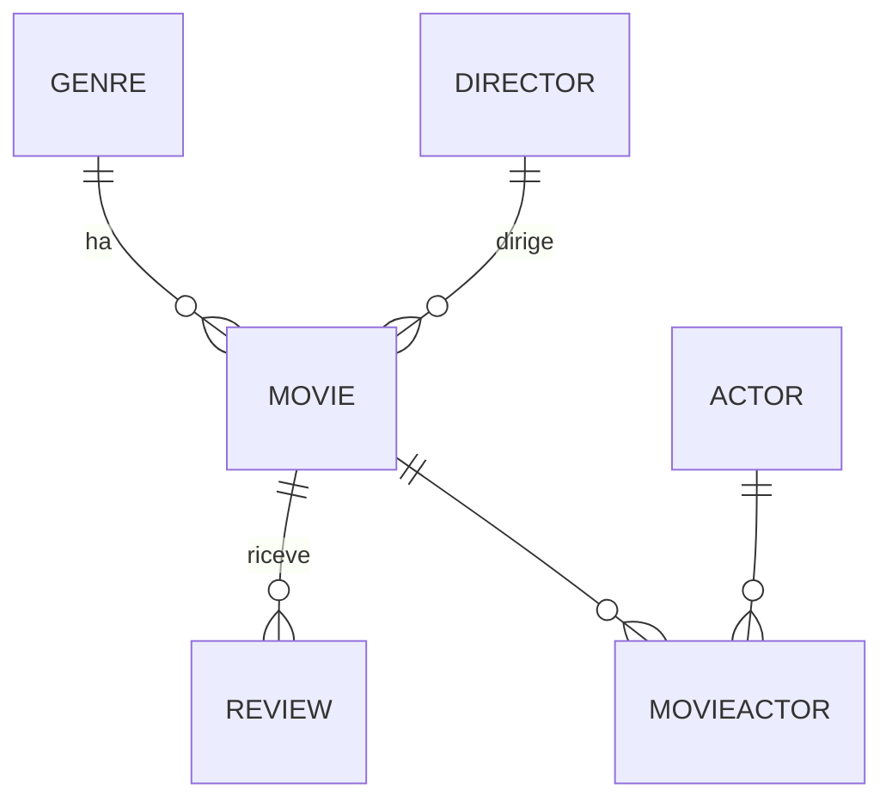

# MovieManager — Web API a strati in ASP.NET Core (.NET 10)

Questo progetto è la ricostruzione, passo per passo, di un gestionale per un **catalogo di film** realizzato come Web API in C# con **.NET 10**. L'ho costruito seguendo le guide dell'esercizio e ho documentato ogni pezzo che implementavo in un file dedicato dentro la cartella [`docs/`](docs/), esattamente come avevo fatto per il gestionale dipendenti in Java.

L'obiettivo non è solo "far funzionare le cose", ma capire **perché** si struttura un progetto in questo modo: separazione in livelli (DAL / BLL / PL), repository, unit of work, servizi generici, mapping automatico e documentazione automatica delle API.

> **Nota sulle immagini:** i riferimenti alle immagini (`res/...`) sono segnaposto. Le screenshot le sistemo io più avanti, quindi se vedi qualche immagine "rotta" è normale.

---

# Indice

- [Risorse utilizzate](#risorse-utilizzate)
- [Traccia e flow dell'esercizio](#traccia-e-flow-dellesercizio)
- [Architettura generale](#architettura-generale)
- [Il database in breve](#il-database-in-breve)
- [Come avviare il progetto](#come-avviare-il-progetto)
- [Nota sui pacchetti e sulla sicurezza](#nota-sui-pacchetti-e-sulla-sicurezza)
- **Documentazione passo-passo** — come ho costruito il progetto, una parte per file:
  1. [Struttura della solution e architettura a strati](docs/01-struttura-e-architettura.md)
  2. [DAL — Le entità](docs/02-dal-entita.md)
  3. [DAL — Il DbContext (Entity Framework Core)](docs/03-dal-dbcontext.md)
  4. [DAL — Generic Repository e Unit of Work](docs/04-dal-repository-unitofwork.md)
  5. [BLL — I Model, IModelWithId e la validazione](docs/05-bll-models.md)
  6. [BLL — Generic Service, MovieActorService, async/await](docs/06-bll-services.md)
  7. [PL — AutoMapper e il MappingProfile](docs/07-plapi-automapper-mapping.md)
  8. [PL — I Controller API](docs/08-plapi-controllers.md)
  9. [PL — Program.cs, Dependency Injection e Scalar](docs/09-plapi-program-di-scalar.md)
- **Approfondimenti pratici** — non "come l'ho costruito" ma "come si usa e cosa c'è sotto":
  10. [Il database — SQL Server, schema e SQL dalle basi alle join](docs/10-database-sql-server.md)
  11. [Scalar — provare le API dal browser](docs/11-scalar-e-prova-api.md)
  12. [Dal Controller all'SQL — il flusso completo e i metodi `To*`](docs/12-dal-controller-all-sql.md)
  13. [Le migration — versionare lo schema del database](docs/13-migrations.md)
  14. [SQL Server e SSMS — usare il database come al lavoro](docs/14-sql-server-e-ssms.md)
- [`COMANDI.txt`](COMANDI.txt) — tutti i comandi CRUD pronti all'uso (Scalar, PowerShell, sqlcmd, `dotnet ef`)

---

## Risorse utilizzate:

- [.NET 10 SDK](https://dotnet.microsoft.com/)
  - SDK e runtime per compilare ed eseguire il progetto (C# 14, ASP.NET Core 10).
- [Visual Studio 2026 / VS Code](https://visualstudio.microsoft.com/)
  - IDE per lo sviluppo C#. VS Code l'ho usato per scrivere questo readme.
- [Entity Framework Core](https://learn.microsoft.com/ef/core/)
  - ORM per mappare le classi C# su tabelle di database senza scrivere SQL a mano.
- [SQL Server LocalDB](https://learn.microsoft.com/sql/database-engine/configure-windows/sql-server-express-localdb)
  - Motore SQL Server "leggero" per sviluppo locale, installato con Visual Studio.
- [AutoMapper](https://automapper.org/)
  - Libreria per convertire automaticamente entità del DAL nei model del BLL e viceversa.
- [Scalar](https://scalar.com/)
  - UI interattiva moderna per esplorare e provare le API a partire dal documento OpenAPI.
- [OpenAPI](https://learn.microsoft.com/aspnet/core/fundamentals/openapi/)
  - Standard per descrivere le API REST; in .NET 10 è generato in modo nativo.
- [ChatGPT](https://chatgpt.com/)
  - Compagno AI per studio.
- [Claude](https://claude.ai/)
  - Compagno AI per studio e revisione codice.

---

## Traccia e flow dell'esercizio

L'esercizio chiede di realizzare un gestionale per un catalogo di film esponendo delle **API REST**. Rispetto al vecchio gestionale dipendenti (servlet + JSP), qui non ho pagine HTML: l'interfaccia è direttamente la documentazione interattiva **Scalar**, dalla quale posso provare tutte le operazioni CRUD.

Il flusso di una richiesta attraversa i tre livelli del progetto:

```
Client (Scalar / browser / Postman)
        │  HTTP (JSON)
        ▼
[ PL ]  Controller  ──►  IGenericService<TModel>
        │
        ▼
[ BLL ] GenericService  ──►  IUnitOfWork / IGenericRepository<TEntity>  +  AutoMapper
        │
        ▼
[ DAL ] Repository  ──►  MovieDbContext (EF Core)  ──►  SQL Server LocalDB
```

Concretamente, una `GET /api/movies/3` tocca **sei file** in fila, e a ogni passaggio il dato cambia forma:

| Passo | File | Il film è… |
|-------|------|------------|
| 1 | `Controllers/MoviesController.cs` | una richiesta HTTP |
| 2 | `Services/GenericService.cs` | un `MovieModel` (BLL) |
| 3 | `Repositories/GenericRepository.cs` | un `Movie` (entità DAL) |
| 4 | EF Core → `Data/MovieDbContext.cs` | una `SELECT` |
| 5 | SQL Server | una riga della tabella `Movies` |
| ↩ | e al ritorno la strada inversa | JSON |

Ogni livello parla **solo** con quello sotto: il controller non sa che esiste un database, il DAL non sa che esiste l'HTTP. Le tre rappresentazioni dello stesso film (JSON, model, entità) non sono una complicazione inutile — sono il motivo per cui si può cambiare un pezzo senza toccare gli altri.

📖 **Il flusso passo per passo, con l'SQL vero che ne esce, è nel [capitolo 12](docs/12-dal-controller-all-sql.md).** Il viaggio visto dal lato `async`/`await` — cosa fa il thread mentre il database risponde — è nel [capitolo 6](docs/06-bll-services.md).


---

## Architettura generale

Il progetto è una **solution a tre progetti**, ognuno con una responsabilità precisa:

| Progetto | Ruolo | Contiene |
|----------|-------|----------|
| `MovieManager.DAL` | Data Access Layer | Entità, `MovieDbContext`, repository, unit of work |
| `MovieManager.BLL` | Business Logic Layer | Model, `IModelWithId`, servizi (`GenericService`, `MovieActorService`) |
| `MovieManager.PL.API` | Presentation Layer | Controller API, `MappingProfile`, `Program.cs`, configurazione Scalar |

Le dipendenze vanno **in una sola direzione** (dall'alto verso il basso):



Il **dominio** gestito è un catalogo di film con 6 entità: `Genre`, `Director`, `Actor`, `Movie`, `MovieActor` (tabella ponte) e `Review`.



---

## Il database in breve

Il DBMS è **SQL Server**, nell'edizione **LocalDB** (quella leggera che si installa con Visual Studio e si avvia da sola, senza servizi né configurazione).

| | |
|---|---|
| **Istanza** | `(localdb)\MSSQLLocalDB` |
| **Database** | `MovieManagerDb` |
| **Autenticazione** | Windows (`Trusted_Connection=True`) — niente utente e password |
| **Schema** | generato da EF Core con `EnsureCreated()`, senza migration ([perché, e cosa costerebbe cambiare](docs/13-migrations.md)) |
| **Dati** | inseriti da `MovieDbSeeder` a ogni avvio, in modo idempotente |
| **Tabelle** | `Genres`, `Directors`, `Actors`, `Movies`, `MovieActors`, `Reviews` |

Non c'è niente da installare né da creare a mano: **al primo `dotnet run` il database viene creato e popolato da solo**. Dopo l'avvio ci sono 5 generi, 5 registi, 10 attori, 6 film, 11 collegamenti di cast e 7 recensioni.

Tre cose che vale la pena sapere subito, perché sono quelle su cui si sbatte:

- **L'`Id` lo assegna il database** (colonna `IDENTITY`). Nelle POST il campo `id` del body viene ignorato. L'unica eccezione è `MovieActors`, la cui chiave `(movieId, actorId)` la scegli tu.
- **Le `DELETE` cancellano a cascata.** Tutte le foreign key sono in `ON DELETE CASCADE` e la cascata è a più livelli: cancellare un *genere* si porta via i suoi film e, con loro, le loro recensioni e il loro cast. Misurato: eliminare il solo genere "Fantascienza" fa sparire 2 film, 3 recensioni e 5 righe di cast.
- **Le `PUT` sostituiscono l'intera risorsa.** I campi omessi dal body diventano `null`, non restano al valore precedente.

Per guardare dentro il database senza passare dall'applicazione:

```powershell
sqlcmd -S "(localdb)\MSSQLLocalDB" -d MovieManagerDb -Q "SELECT Id, Title FROM Movies;" -W
```

📖 Il resto sta in tre capitoli, secondo cosa serve:

| Domanda | Capitolo |
|---------|----------|
| Com'è fatto lo schema? Come si scrive SQL, dalle `SELECT` alle join, subquery, window function, `SELECT INTO`, transazioni e vincoli? E cos'è SQL Server come servizio, rispetto a LocalDB? | [10 — Il database](docs/10-database-sql-server.md) |
| Cosa succede tra la richiesta HTTP e la riga di SQL Server? Quando parte davvero una query e chi la fa partire (`ToListAsync`, `ToDictionaryAsync`, `ProjectTo`…)? | [12 — Dal Controller all'SQL](docs/12-dal-controller-all-sql.md) |
| Come si cambia lo schema **senza perdere i dati**? Cosa sono le migration e quali sono i comandi? | [13 — Le migration](docs/13-migrations.md) |
| Come si usa **SSMS**? Piani di esecuzione, backup, permessi — cioè come si lavora su SQL Server fuori da un esercizio | [14 — SQL Server e SSMS](docs/14-sql-server-e-ssms.md) |

I comandi pronti da copiare sono in [`COMANDI.txt`](COMANDI.txt).

---

## Come avviare il progetto

### 1) Prerequisiti

- **.NET 10 SDK** (`dotnet --version` deve restituire `10.x`).
- **SQL Server LocalDB** (verifica con `sqllocaldb info`: dovresti vedere `MSSQLLocalDB`).

### 2) Stringa di connessione

È già configurata in `MovieManager.PL.API/appsettings.json` e punta a LocalDB:

```json
"ConnectionStrings": {
  "DefaultConnection": "Server=(localdb)\\MSSQLLocalDB;Database=MovieManagerDb;Trusted_Connection=True;TrustServerCertificate=True"
}
```

Al primo avvio `Program.cs` fa due cose in fila:

1. `db.Database.EnsureCreated()` — se `MovieManagerDb` non esiste, lo crea con tutte le tabelle e i vincoli. Nessuna migration da lanciare a mano.
2. `MovieDbSeeder.SeedAsync(db)` — inserisce i dati di esempio che mancano.

Il seeder è **idempotente**: confronta la chiave naturale (il nome del genere, il titolo del film) e non l'Id, quindi a ogni riavvio non duplica niente e non sovrascrive le righe aggiunte da me. Se cancello un dato del seed, al riavvio torna; i dati miei restano dove sono.

> **Ripartire da zero.** Siccome `EnsureCreated()` non aggiorna uno schema esistente, per rivedere una modifica alle entità (o per tornare ai soli dati del seed) va eliminato il database. Fermata l'app:
>
> ```powershell
> sqlcmd -S "(localdb)\MSSQLLocalDB" -Q "ALTER DATABASE MovieManagerDb SET SINGLE_USER WITH ROLLBACK IMMEDIATE; DROP DATABASE MovieManagerDb;"
> ```
>
> Al riavvio viene ricreato e ripopolato. In alternativa, da Visual Studio → SQL Server Object Explorer.

### 3) Avvio

Dalla cartella della solution:

```bash
dotnet run --project MovieManager.PL.API
```

Il browser si apre da solo sulla pagina Scalar.

### 4) Endpoint utili

`launchSettings.json` ha due profili, e `dotnet run` senza argomenti usa il **primo**, cioè `http`:

| Profilo | Comando | Scalar |
|---------|---------|--------|
| `http` (predefinito) | `dotnet run --project MovieManager.PL.API` | `http://localhost:5140/scalar` |
| `https` | `dotnet run --project MovieManager.PL.API --launch-profile https` | `https://localhost:7109/scalar` |

Con il profilo predefinito:

- **UI Scalar:** `http://localhost:5140/scalar`
- **Documento OpenAPI (JSON):** `http://localhost:5140/openapi/v1.json`
- **API REST:** `http://localhost:5140/api/movies`, `/api/genres`, `/api/directors`, `/api/actors`, `/api/reviews`, `/api/movieactors`

> L'avviso `Failed to determine the https port for redirect` che compare nel log con il profilo `http` è innocuo: `UseHttpsRedirection()` cerca una porta HTTPS che con quel profilo non è in ascolto.

---

## Nota sui pacchetti e sulla sicurezza

Le guide fissano `AutoMapper` alla **versione 14.0.0** e il progetto la rispetta. Attenzione però: durante la build compare un avviso `NU1903` perché quella versione ha un advisory di sicurezza noto (`GHSA-rvv3-g6hj-g44x`). Ho scelto di **non** aggiornare alla major più recente perché dalla 15/16 AutoMapper è diventato commerciale e richiede una licenza a runtime, cosa che romperebbe l'avvio dell'app. Se in futuro serve rimuovere l'avviso, va valutata una 14.0.x patchata o un mapping manuale. Un secondo avviso analogo riguarda `Microsoft.OpenApi 2.0.0`, che arriva come dipendenza transitiva del pacchetto OpenAPI di .NET 10.
