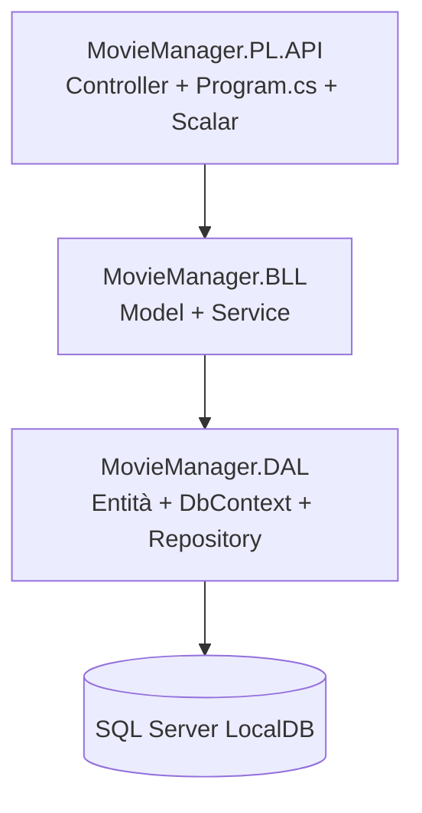
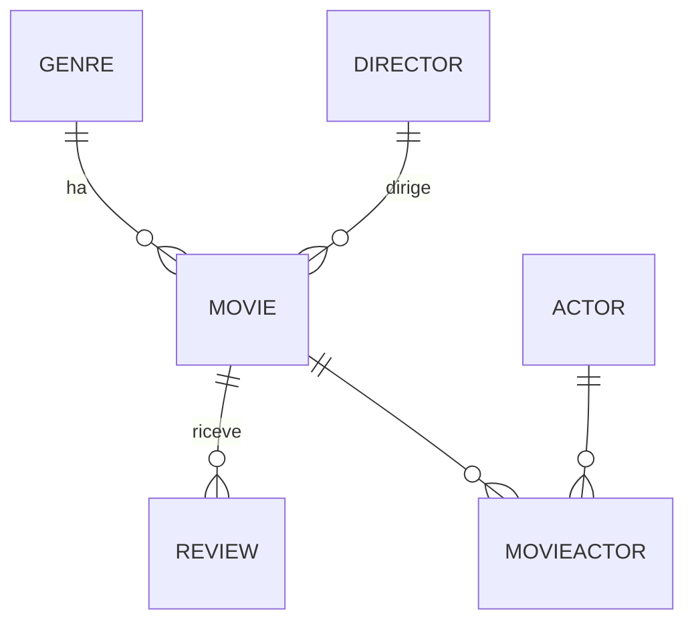

# MovieManager — Web API a strati in ASP.NET Core (.NET 10)

Questo progetto è la ricostruzione, passo per passo, di un gestionale per un **catalogo di film** realizzato come Web API in C# con **.NET 10**. L'ho costruito seguendo le guide dell'esercizio e ho documentato ogni pezzo che implementavo in un file dedicato dentro la cartella [`docs/`](docs/), esattamente come avevo fatto per il gestionale dipendenti in Java.

L'obiettivo non è solo "far funzionare le cose", ma capire **perché** si struttura un progetto in questo modo: separazione in livelli (DAL / BLL / PL), repository, unit of work, servizi generici, mapping automatico e documentazione automatica delle API.

> **Nota sulle immagini:** i riferimenti alle immagini (`res/...`) sono segnaposto. Le screenshot le sistemo io più avanti, quindi se vedi qualche immagine "rotta" è normale.

---

# Indice

- [Risorse utilizzate](#risorse-utilizzate)
- [Traccia e flow dell'esercizio](#traccia-e-flow-dellesercizio)
- [Architettura generale](#architettura-generale)
- [Come avviare il progetto](#come-avviare-il-progetto)
- **Documentazione passo-passo** (una parte per file):
  1. [Struttura della solution e architettura a strati](docs/01-struttura-e-architettura.md)
  2. [DAL — Le entità](docs/02-dal-entita.md)
  3. [DAL — Il DbContext (Entity Framework Core)](docs/03-dal-dbcontext.md)
  4. [DAL — Generic Repository e Unit of Work](docs/04-dal-repository-unitofwork.md)
  5. [BLL — I Model e l'interfaccia IModelWithId](docs/05-bll-models.md)
  6. [BLL — Generic Service, MovieActorService, async/await](docs/06-bll-services.md)
  7. [PL — AutoMapper e il MappingProfile](docs/07-plapi-automapper-mapping.md)
  8. [PL — I Controller API](docs/08-plapi-controllers.md)
  9. [PL — Program.cs, Dependency Injection e Scalar](docs/09-plapi-program-di-scalar.md)

---

## Risorse utilizzate:

- [.NET 10 SDK](https://dotnet.microsoft.com/)
  - SDK e runtime per compilare ed eseguire il progetto (C# 14, ASP.NET Core 10).
- [Visual Studio 2026 / VS Code](https://visualstudio.microsoft.com/)
  - IDE per lo sviluppo C#. VS Code l'ho usato per scrivere questo readme.
- [Entity Framework Core](https://learn.microsoft.com/ef/core/)
  - ORM per mappare le classi C# su tabelle di database senza scrivere SQL a mano.
- [SQL Server LocalDB](https://learn.microsoft.com/sql/database-engine/configure-windows/sql-server-express-localdb)
  - Motore SQL Server "leggero" per sviluppo locale, installato con Visual Studio.
- [AutoMapper](https://automapper.org/)
  - Libreria per convertire automaticamente entità del DAL nei model del BLL e viceversa.
- [Scalar](https://scalar.com/)
  - UI interattiva moderna per esplorare e provare le API a partire dal documento OpenAPI.
- [OpenAPI](https://learn.microsoft.com/aspnet/core/fundamentals/openapi/)
  - Standard per descrivere le API REST; in .NET 10 è generato in modo nativo.
- [ChatGPT](https://chatgpt.com/)
  - Compagno AI per studio.
- [Claude](https://claude.ai/)
  - Compagno AI per studio e revisione codice.

---

## Traccia e flow dell'esercizio

L'esercizio chiede di realizzare un gestionale per un catalogo di film esponendo delle **API REST**. Rispetto al vecchio gestionale dipendenti (servlet + JSP), qui non ho pagine HTML: l'interfaccia è direttamente la documentazione interattiva **Scalar**, dalla quale posso provare tutte le operazioni CRUD.

Il flusso di una richiesta attraversa i tre livelli del progetto:

```
Client (Scalar / browser / Postman)
        │  HTTP (JSON)
        ▼
[ PL ]  Controller  ──►  IGenericService<TModel>
        │
        ▼
[ BLL ] GenericService  ──►  IUnitOfWork / IGenericRepository<TEntity>  +  AutoMapper
        │
        ▼
[ DAL ] Repository  ──►  MovieDbContext (EF Core)  ──►  SQL Server LocalDB
```


---

## Architettura generale

Il progetto è una **solution a tre progetti**, ognuno con una responsabilità precisa:

| Progetto | Ruolo | Contiene |
|----------|-------|----------|
| `MovieManager.DAL` | Data Access Layer | Entità, `MovieDbContext`, repository, unit of work |
| `MovieManager.BLL` | Business Logic Layer | Model, `IModelWithId`, servizi (`GenericService`, `MovieActorService`) |
| `MovieManager.PL.API` | Presentation Layer | Controller API, `MappingProfile`, `Program.cs`, configurazione Scalar |

Le dipendenze vanno **in una sola direzione** (dall'alto verso il basso):



Il **dominio** gestito è un catalogo di film con 6 entità: `Genre`, `Director`, `Actor`, `Movie`, `MovieActor` (tabella ponte) e `Review`.



---

## Come avviare il progetto

### 1) Prerequisiti

- **.NET 10 SDK** (`dotnet --version` deve restituire `10.x`).
- **SQL Server LocalDB** (verifica con `sqllocaldb info`: dovresti vedere `MSSQLLocalDB`).

### 2) Stringa di connessione

È già configurata in `MovieManager.PL.API/appsettings.json` e punta a LocalDB:

```json
"ConnectionStrings": {
  "DefaultConnection": "Server=(localdb)\\MSSQLLocalDB;Database=MovieManagerDb;Trusted_Connection=True;TrustServerCertificate=True"
}
```

Al primo avvio, `Program.cs` chiama `db.Database.EnsureCreated()`: se il database `MovieManagerDb` non esiste, viene creato automaticamente con tutte le tabelle e i vincoli. Non serve lanciare migration a mano.

> Per ripartire da zero (database vuoto) basta eliminare il database `MovieManagerDb` dal LocalDB (per esempio da Visual Studio → SQL Server Object Explorer, oppure con `sqlcmd`) e riavviare: verrà ricreato.

### 3) Avvio

Dalla cartella della solution:

```bash
dotnet run --project MovieManager.PL.API
```

Il profilo `https` di `launchSettings.json` apre in automatico il browser sulla pagina Scalar.

### 4) Endpoint utili

- **UI Scalar:** `https://localhost:7109/scalar`
- **Documento OpenAPI (JSON):** `https://localhost:7109/openapi/v1.json`
- **API REST:** `https://localhost:7109/api/movies`, `/api/genres`, `/api/directors`, `/api/actors`, `/api/reviews`, `/api/movieactors`

(Le porte dipendono dal `launchSettings.json` attivo.)

---

## Nota sui pacchetti e sulla sicurezza

Le guide fissano `AutoMapper` alla **versione 14.0.0** e il progetto la rispetta. Attenzione però: durante la build compare un avviso `NU1903` perché quella versione ha un advisory di sicurezza noto (`GHSA-rvv3-g6hj-g44x`). Ho scelto di **non** aggiornare alla major più recente perché dalla 15/16 AutoMapper è diventato commerciale e richiede una licenza a runtime, cosa che romperebbe l'avvio dell'app. Se in futuro serve rimuovere l'avviso, va valutata una 14.0.x patchata o un mapping manuale. Un secondo avviso analogo riguarda `Microsoft.OpenApi 2.0.0`, che arriva come dipendenza transitiva del pacchetto OpenAPI di .NET 10.
