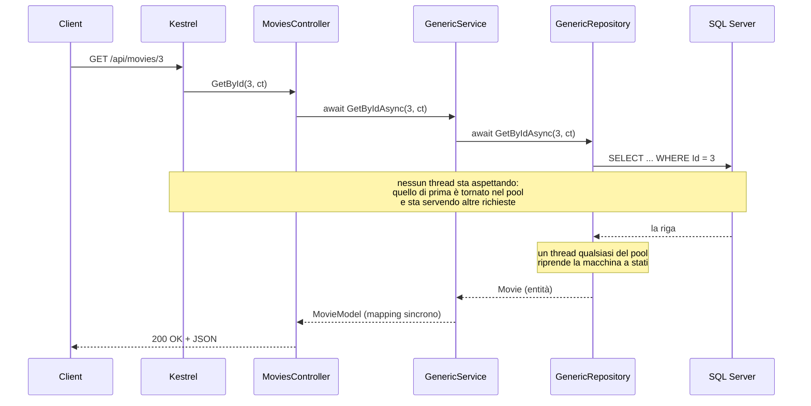

# 6) BLL — Generic Service, MovieActorService, async/await

[⬅ Torna all'indice](../README.md)

I model sono pronti; ora serve chi ci lavora sopra: i **service**. Sono il cuore del Business Logic Layer e vanno in `MovieManager.BLL/Services`.

---

## (?) Che cosa fa un service nel BLL?

Il service è l'intermediario tra i controller (che parlano HTTP) e i repository (che parlano col database). Le sue responsabilità:

1. esporre le operazioni applicative (qui il CRUD);
2. usare repository e unit of work senza esporli ai controller;
3. lavorare con i **model** del BLL, non con le entità del DAL;
4. convertire model ↔ entità tramite AutoMapper.

Come per i repository, invece di scrivere un service per entità, ne scrivo **uno generico** che vale per tutte.

---

## 6.1 L'interfaccia IGenericService

File: `Services/Interfaces/IGenericService.cs`:

```csharp
namespace MovieManager.BLL.Services.Interfaces
{
    public interface IGenericService<TModel> where TModel : class
    {
        Task<TModel?> GetByIdAsync(int id, CancellationToken cancellationToken = default);
        Task<IReadOnlyList<TModel>> GetAllAsync(CancellationToken cancellationToken = default);
        Task<TModel> CreateAsync(TModel model, CancellationToken cancellationToken = default);
        Task<bool> UpdateAsync(TModel model, CancellationToken cancellationToken = default);
        Task<bool> DeleteAsync(int id, CancellationToken cancellationToken = default);
    }
}
```

Il tipo di ritorno **`bool`** di `UpdateAsync`/`DeleteAsync` ha un significato applicativo preciso:

- `true` → operazione eseguita;
- `false` → record non trovato.

Sarà il controller a tradurre questo `bool` in uno status HTTP (`204` oppure `404`).

---

## 6.2 L'implementazione GenericService

File: `Services/GenericService.cs`. Qui i generics diventano **due**: uno per l'entità del DAL, uno per il model del BLL.

```csharp
using AutoMapper;
using MovieManager.BLL.Models;
using MovieManager.BLL.Services.Interfaces;
using MovieManager.DAL.Repositories.Interfaces;

namespace MovieManager.BLL.Services
{
    public class GenericService<TEntity, TModel> : IGenericService<TModel>
        where TEntity : class, new()
        where TModel : class, IModelWithId, new()
    {
        private readonly IUnitOfWork _unitOfWork;
        private readonly IGenericRepository<TEntity> _repository;
        private readonly IMapper _mapper;

        public GenericService(IUnitOfWork unitOfWork, IMapper mapper)
        {
            _unitOfWork = unitOfWork;
            _repository = unitOfWork.Repository<TEntity>();
            _mapper = mapper;
        }
        // ... metodi ...
    }
}
```

### (?) Cosa significano i vincoli generici?

- `where TEntity : class, new()` → `TEntity` è una classe (reference type) e ha un **costruttore vuoto** (`new()`), così AutoMapper può istanziarla.
- `where TModel : class, IModelWithId, new()` → `TModel` è una classe, ha il costruttore vuoto **e** implementa `IModelWithId`. Grazie a quest'ultimo posso scrivere `model.Id` in sicurezza (vedi [capitolo 5](05-bll-models.md)).

### Le dipendenze del costruttore

Il service riceve via DI la **Unit of Work** e il **mapper**. Il repository non lo riceve direttamente: lo chiede alla UoW con `unitOfWork.Repository<TEntity>()`, così tutto passa dallo stesso `DbContext` e il salvataggio resta centralizzato.

### I metodi, uno per uno

```csharp
public async Task<TModel?> GetByIdAsync(int id, CancellationToken cancellationToken = default)
{
    var entity = await _repository.GetByIdAsync(id, cancellationToken);
    return entity is null ? null : _mapper.Map<TModel>(entity);   // entità -> model
}

public async Task<IReadOnlyList<TModel>> GetAllAsync(CancellationToken cancellationToken = default)
{
    var entities = await _repository.GetAllAsync(cancellationToken);
    return _mapper.Map<IReadOnlyList<TModel>>(entities);
}

public async Task<TModel> CreateAsync(TModel model, CancellationToken cancellationToken = default)
{
    model.Id = 0;                                    // l'Id lo genera il database (vedi sotto)

    var entity = _mapper.Map<TEntity>(model);        // model -> entità
    await _repository.AddAsync(entity, cancellationToken);
    await _unitOfWork.SaveChangesAsync(cancellationToken);   // il salvataggio è QUI
    return _mapper.Map<TModel>(entity);              // rileggo l'Id generato dal DB
}

public async Task<bool> UpdateAsync(TModel model, CancellationToken cancellationToken = default)
{
    var existing = await _repository.GetByIdAsync(model.Id, cancellationToken);
    if (existing is null) return false;              // non trovato

    _mapper.Map(model, existing);                    // aggiorno l'entità GIÀ tracciata
    _repository.Update(existing);
    await _unitOfWork.SaveChangesAsync(cancellationToken);
    return true;
}

public async Task<bool> DeleteAsync(int id, CancellationToken cancellationToken = default)
{
    var entity = await _repository.GetByIdAsync(id, cancellationToken);
    if (entity is null) return false;

    _repository.Remove(entity);
    await _unitOfWork.SaveChangesAsync(cancellationToken);
    return true;
}
```

Il punto architetturale chiave: **il `SaveChangesAsync` è sempre nel service**, mai nel repository. Il repository prepara la modifica, il service decide l'esito (`true`/`false`) e la Unit of Work conferma con una transazione.

### (?) Perché `CreateAsync` azzera l'Id? (il bug che mi ha fatto perdere un pomeriggio)

Questa riga è nata da un errore vero:

```csharp
model.Id = 0;
```

Provando una `POST /api/Actors` da Scalar, con il body di esempio che include `"id"` valorizzato, ottenevo:

```
Cannot insert explicit value for identity column in table 'Actors'
when IDENTITY_INSERT is set to OFF.
```

Cosa succedeva: `Id` è una colonna **IDENTITY** e il valore lo assegna SQL Server. EF Core decide se includere `Id` nell'`INSERT` guardando se è valorizzato: se è `0` capisce "non impostato" e lascia fare al database; se è diverso da zero pensa che io voglia **imporre** quella chiave e genera `INSERT INTO [Actors] ([Id], ...)`. SQL Server lo rifiuta con l'errore **544**.

Il paradosso è che il primo attore era entrato senza problemi: quella volta l'`id` nel body era `0`. Il bug si presentava **solo** con un id diverso da zero, ed era quindi facile da non notare.

Azzerando l'Id in entrata, l'`INSERT` generato torna quello giusto (senza la colonna `Id`) e la chiave la mette il database. È anche la scelta corretta come REST: **su una create, l'id non lo decide il client**. Un id mandato per sbaglio non viene rifiutato, viene semplicemente ignorato.

La riga sta qui, nel service generico, e non in ognuno dei cinque controller: è il vantaggio del `GenericService`, una correzione sola vale per Actors, Directors, Genres, Movies e Reviews insieme. Funziona per tutti perché `TModel : IModelWithId` garantisce a compile-time che `model.Id` esista — la stessa interfaccia del [capitolo 5](05-bll-models.md) che sembrava ridondante.

> `MovieActorService` **non** fa niente del genere, ed è giusto così: la sua chiave `(MovieId, ActorId)` non è generata dal database, la sceglie il client e deve puntare a righe esistenti.

Il dettaglio su IDENTITY e sull'SQL generato prima e dopo è nel [capitolo 10](10-database-sql-server.md).

> **Nota sul disallineamento delle firme.** Nel repository `Update`/`Remove` sono `void`; nel service `UpdateAsync`/`DeleteAsync` ritornano `bool`. Non è un errore: nel repository sono comandi sul change tracker di EF (non sanno se il record "esisteva"), mentre nel service il `bool` è una **regola applicativa** (prima controllo se il record c'è, poi agisco). Sono due livelli con responsabilità diverse.

---

## 6.3 Il servizio dedicato: MovieActorService

Il `GenericService` funziona solo con model `IModelWithId` a chiave singola. `MovieActorModel` non lo è, quindi ha il suo servizio dedicato, gemello del suo repository dedicato.

`Services/Interfaces/IMovieActorService.cs`:

```csharp
using MovieManager.BLL.Models;

namespace MovieManager.BLL.Services.Interfaces
{
    public interface IMovieActorService
    {
        Task<MovieActorModel?> GetByIdsAsync(int movieId, int actorId, CancellationToken cancellationToken = default);
        Task<IReadOnlyList<MovieActorModel>> GetByMovieIdAsync(int movieId, CancellationToken cancellationToken = default);
        Task<MovieActorModel> CreateAsync(MovieActorModel model, CancellationToken cancellationToken = default);
        Task<bool> UpdateAsync(MovieActorModel model, CancellationToken cancellationToken = default);
        Task<bool> DeleteAsync(int movieId, int actorId, CancellationToken cancellationToken = default);
    }
}
```

L'implementazione `Services/MovieActorService.cs` è concettualmente identica al generic service, ma usa `IMovieActorRepository` e lavora sulla coppia di chiavi:

```csharp
public MovieActorService(IMovieActorRepository repository, IUnitOfWork unitOfWork, IMapper mapper)
{
    _repository = repository;
    _unitOfWork = unitOfWork;
    _mapper = mapper;
}

public async Task<bool> DeleteAsync(int movieId, int actorId, CancellationToken cancellationToken = default)
{
    var entity = await _repository.GetByIdsAsync(movieId, actorId, cancellationToken);
    if (entity is null) return false;

    _repository.Remove(entity);
    await _unitOfWork.SaveChangesAsync(cancellationToken);
    return true;
}
```

Nota che usa comunque la **stessa** `IUnitOfWork` per il commit: repository dedicato per la ricerca a doppia chiave, unit of work condivisa per il salvataggio.

---

## 6.4 Async e await: cosa succede davvero a ogni await

Tutti i metodi che ho scritto fin qui sono asincroni, e non solo quelli del BLL: l'asincronia parte dai controller e arriva fino a EF Core che apre la connessione a SQL Server. Non è una decorazione né una moda — è la scelta che decide **quante richieste il server riesce a servire insieme**. Siccome i service sono il punto in cui la catena si vede meglio (ricevono dal controller, chiamano il repository, aspettano il database), l'approfondimento sta qui.

Prima la mappa: dov'è l'`async` in tutto il progetto, e cosa sta aspettando davvero ciascuno.

| Livello | Metodo | Firma | Cosa aspetta davvero |
|---------|--------|-------|----------------------|
| PL | `MoviesController.GetById` e gli altri 29 action | `async Task<ActionResult<T>>` | il service |
| PL | `DatabaseExceptionHandler.TryHandleAsync` | `async ValueTask<bool>` | la scrittura del JSON di errore |
| BLL | `GenericService.GetByIdAsync` | `async Task<TModel?>` | il repository (il mapping è sincrono) |
| BLL | `MovieActorService.CreateAsync` | `async Task<MovieActorModel>` | repository + unit of work |
| DAL | `GenericRepository.GetAllAsync` | `async Task<IReadOnlyList<T>>` | `ToListAsync`, cioè la `SELECT` |
| DAL | `GenericRepository.AddAsync` | `async Task` | **niente**: completa in modo sincrono |
| DAL | `UnitOfWork.SaveChangesAsync` | `async Task<int>` | l'`INSERT`/`UPDATE`/`DELETE` e il commit |
| DAL | `MovieDbSeeder.SeedAsync` | `async Task` | sei fasi di seeding, una dopo l'altra |
| DAL | `GenericRepository.Update` / `Remove` | `void` | — non fanno I/O, e sotto spiego perché |

### Il problema: cosa fa un thread mentre il database risponde

Una `GET /api/movies` sembra lavoro per la CPU, e invece non lo è quasi per niente. Il tempo se ne va tutto in **attesa**: la query parte verso SQL Server, attraversa un socket, il database la esegue, la risposta torna indietro. Nel mezzo il processo .NET non ha niente da calcolare. La domanda è cosa fa il thread durante quell'attesa.

**Versione sincrona** (`repository.GetAll()`): il thread resta fermo davanti al socket a non fare nulla finché i dati non arrivano. E non è gratis:

- ogni thread si porta dietro circa 1 MB di stack riservato;
- Kestrel prende i thread dal **thread pool**, che è condiviso da tutta l'applicazione;
- quando il pool è saturo .NET ne aggiunge di nuovi con molta calma (nell'ordine di un paio al secondo), quindi le richieste in eccesso si accodano e la latenza esplode. È la **thread pool starvation**, e il paradosso è che succede con la CPU quasi ferma: i thread ci sono, sono solo tutti bloccati ad aspettare.

**Versione asincrona** (`await repository.GetAllAsync()`): appena la query è partita il thread **torna al pool** e va a servire un'altra richiesta. Quando SQL Server risponde, un thread qualsiasi del pool riprende il lavoro da dov'era rimasto. Durante l'attesa, quella richiesta non occupa **nessun** thread.

> **Async non rende la singola richiesta più veloce.** Una `GET /api/movies/3` asincrona impiega quanto quella sincrona, anzi qualche microsecondo in più per via della macchina a stati. Quello che cambia è quante richieste **contemporanee** reggono gli stessi thread. Async è scalabilità, non velocità.

### Task, async, await: cosa vogliono dire davvero

Il metodo più corto del progetto le usa tutte e tre:

```csharp
// MovieManager.DAL/Repositories/GenericRepository.cs
public async Task<IReadOnlyList<T>> GetAllAsync(CancellationToken cancellationToken = default)
    => await _dbSet.AsNoTracking().ToListAsync(cancellationToken);
```

- **`Task<T>`** non è l'operazione: è la **ricevuta** dell'operazione. Un oggetto che dice "un `IReadOnlyList<T>` arriverà, e quando arriva te lo do". `Task` senza generic è la stessa cosa per chi non restituisce niente (`AddAsync`, `SeedAsync`).
- **`async`** non rende asincrono un bel niente. Fa due cose sole: permette di usare `await` nel corpo, e dice al compilatore di riscrivere il metodo in una macchina a stati. Un metodo `async` senza `await` dentro è sincrono a tutti gli effetti, e il compilatore lo segnala (CS1998).
- **`await`** è la parola su cui si sbaglia di più. Non vuol dire "blocca qui finché non è pronto". Vuol dire: **"se non è pronto, sospendi il metodo, ridai il controllo al chiamante, e riprendi da questo punto quando lo sarà"**.

### Cosa genera il compilatore

Quello che scrivo io (è il `GetByIdAsync` di [6.2](#i-metodi-uno-per-uno)):

```csharp
public async Task<TModel?> GetByIdAsync(int id, CancellationToken cancellationToken = default)
{
    var entity = await _repository.GetByIdAsync(id, cancellationToken);
    return entity is null ? null : _mapper.Map<TModel>(entity);
}
```

Quello che il compilatore ne fa, semplificando parecchio:

```csharp
public Task<TModel?> GetByIdAsync(int id, CancellationToken cancellationToken = default)
{
    // Tutto quello che sta PRIMA del primo await gira subito, sul thread del chiamante.
    var pending = _repository.GetByIdAsync(id, cancellationToken);

    // Il risultato c'è già? Nessuna sospensione, si tira dritto sullo stesso thread.
    if (pending.IsCompleted)
        return Task.FromResult(Resto(pending.Result));

    // Altrimenti registro "cosa fare dopo" e RESTITUISCO un Task al chiamante:
    // il metodo è tornato, ma non ha finito.
    var ricevuta = new TaskCompletionSource<TModel?>();
    pending.ContinueWith(t =>
    {
        // Si riprende QUI quando il database ha risposto, su un thread
        // qualsiasi del pool: non per forza quello di prima.
        try                  { ricevuta.SetResult(Resto(t.Result)); }
        catch (Exception ex) { ricevuta.SetException(ex); }
    });

    return ricevuta.Task;

    TModel? Resto(TEntity? entity) => entity is null ? null : _mapper.Map<TModel>(entity);
}
```

Da qui discendono quattro conseguenze che spiegano tutto il resto:

1. **Il corpo prima del primo `await` gira in modo sincrono.** `await` non fa partire un thread e non "manda in background" il metodo.
2. **Al primo `await` non ancora completo il metodo ritorna senza aver finito.** Restituisce un `Task` incompleto; il chiamante lo aspetta a sua volta, e il thread risale la catena fino a Kestrel e si libera.
3. **Il `return` non torna al chiamante**: completa il `Task` che il chiamante ha già in mano, e chi era in attesa di quel `Task` si risveglia.
4. **Le eccezioni finiscono dentro il `Task`** e vengono rilanciate al punto di `await` di chi aspetta. È il motivo per cui la `DbUpdateException` che nasce dentro `SaveChangesAsync` risale intatta attraverso repository, service e controller fino a `DatabaseExceptionHandler`, che la traduce in un 400 o in un 409 esattamente come farebbe un `try/catch` normale (vedi [capitolo 9](09-plapi-program-di-scalar.md)).

> Nella realtà il compilatore non usa `ContinueWith` e closure: genera una `struct` che implementa `IAsyncStateMachine`, con un metodo `MoveNext()` e un campo intero che tiene lo stato. Il metodo viene tagliato in pezzi a ogni `await`, e ogni pezzo è uno stato. Finché non c'è una sospensione vera la `struct` resta sullo stack e non alloca niente — ed è il motivo per cui un `await` già completo costa quasi zero. Il concetto però è quello del codice qui sopra.

### Il viaggio di una richiesta, await per await



Il punto è tutto nella nota al centro: fra la `SELECT` e la risposta di SQL Server, **zero thread** sono dedicati a quella richiesta. In più, siccome in ASP.NET Core non esiste un `SynchronizationContext`, la ripresa avviene su un thread qualunque del pool: non c'è nessuna affinità di thread su cui contare (ed è anche il motivo per cui `ConfigureAwait(false)`, raccomandato quando si scrive una libreria, nel codice di un'applicazione ASP.NET Core non serve).

Una `POST /api/movies` invece ha due `await` in fila ma **una sola** vera attesa:

```csharp
public async Task<TModel> CreateAsync(TModel model, CancellationToken cancellationToken = default)
{
    model.Id = 0;                                             // sincrono (il perché è in 6.2)
    var entity = _mapper.Map<TEntity>(model);                 // sincrono (CPU)
    await _repository.AddAsync(entity, cancellationToken);    // completa subito: non aspetta niente
    await _unitOfWork.SaveChangesAsync(cancellationToken);    // ← QUI parte l'INSERT
    return _mapper.Map<TModel>(entity);                       // sincrono: rileggo l'Id scritto da EF
}
```

Perché `AddAsync` non aspetti niente lo vedo tra poco.

### Async all the way: la catena non si può spezzare

`await` si può usare solo dentro un metodo `async`, e un metodo `async` deve restituire un `Task`. Ne segue che l'asincronia è **contagiosa verso l'alto**: perché `ToListAsync` possa liberare il thread, ogni anello sopra di lui dev'essere asincrono a sua volta.

```
MoviesController.GetAll            Task<ActionResult<IReadOnlyList<MovieModel>>>
  GenericService.GetAllAsync       Task<IReadOnlyList<MovieModel>>
    GenericRepository.GetAllAsync  Task<IReadOnlyList<Movie>>
      DbSet.ToListAsync            Task<List<Movie>>
        SqlClient                  ← l'I/O vero
```

In cima alla catena c'è il framework: è ASP.NET Core ad aspettare il `Task` restituito dall'action, quindi nessuno deve mai bloccarsi. Per questo i controller sono dichiarati `public async Task<ActionResult<MovieModel>> GetById(...)` e non `public ActionResult<MovieModel> GetById(...)` (vedi [capitolo 8](08-plapi-controllers.md)).

Se un anello qualsiasi tornasse sincrono con `.Result`, `.Wait()` o `.GetAwaiter().GetResult()`, il thread resterebbe bloccato lì ad aspettare, e tutto il lavoro fatto sotto per liberarlo sarebbe buttato. In ASP.NET Core non si arriva al deadlock classico (non c'è `SynchronizationContext`, a differenza del vecchio ASP.NET e di WinForms), ma sotto carico si finisce esattamente nella thread pool starvation che l'async doveva evitare. In questo progetto **non c'è un solo `.Result` né un `.Wait()`**, e non è un caso.

### Cosa NON è asincrono (e perché è giusto così)

Metà del "capire l'async" è capire dove **non** va messo. `async` serve per l'**I/O** — disco, rete, database — e non ha senso su lavoro che sta già in memoria. In questo progetto restano sincroni, di proposito:

| Codice | Livello | Perché non è async |
|--------|---------|--------------------|
| `_mapper.Map<TModel>(entity)` | BLL | Copia campi da un oggetto a un altro, in RAM. È CPU pura: non c'è nessuna attesa da liberare. Chiuderlo in un `Task.Run` sposterebbe il lavoro su un altro thread aggiungendo overhead, senza guadagnare niente. |
| `GenericRepository.Update` / `Remove` | DAL | Non parlano col database: marcano l'entità come `Modified`/`Deleted` nel change tracker di EF, che è una struttura in memoria. L'SQL parte dopo, in `SaveChangesAsync`. Un `UpdateAsync` qui sarebbe un async finto. (Sul perché ritornino `void` e non `bool` c'è la nota in fondo a 6.2.) |
| `UnitOfWork.Repository<T>()` | DAL | Cerca in un `Dictionary`. |
| `UnitOfWork.Dispose()` | DAL | `IUnitOfWork : IDisposable`, non `IAsyncDisposable`: chiude il `DbContext`. |
| `db.Database.EnsureCreated()` | PL | Gira una volta all'avvio, quando non c'è ancora nessuna richiesta da servire: bloccare il thread di startup non toglie niente a nessuno. `EnsureCreatedAsync` esiste, ma qui non cambierebbe nulla. |
| `app.Run()` | PL | Blocca il thread principale **apposta**: è quello che tiene vivo il processo. |

> La regola in una riga: **`async` per aspettare, non per andare più veloce.**

### Due await che non aspettano: `AddAsync` e le `ValueTask`

**`AddAsync` non tocca il database.** Sembra assurdo, ma è così:

```csharp
// MovieManager.DAL/Repositories/GenericRepository.cs
public async Task AddAsync(T entity, CancellationToken cancellationToken = default)
    => await _dbSet.AddAsync(entity, cancellationToken);
```

`DbSet.AddAsync` marca l'entità come `Added` nel change tracker, e basta: l'`INSERT` lo manda `SaveChangesAsync`. Allora perché EF ne offre una versione async? Per un caso solo: i **generatori di valori che devono interrogare il database** per farsi dare la chiave *prima* dell'insert — tipicamente la strategia `SequenceHiLo`, che si fa riservare un blocco di Id da una sequenza SQL. La documentazione di EF è esplicita: in tutti gli altri casi va usato `Add`, quello sincrono.

Qui nessuna entità è in quel caso: gli `Id` sono colonne `IDENTITY` (li assegna SQL Server durante l'`INSERT`, vedi [capitolo 10](10-database-sql-server.md)) e la chiave di `MovieActor` la manda il client. Quindi **`AddAsync` completa sempre in modo sincrono**: quell'`await` non sospende mai niente. `_dbSet.Add(entity)` sarebbe altrettanto corretto e un filo più economico; l'ho lasciato async per simmetria col resto dell'interfaccia — è una scelta difendibile, non una necessità.

Ed è la lezione che conta: **`await` non significa "qui c'è un'attesa"**. Se il `Task` è già completo, `await` prende il risultato e prosegue sullo stesso thread, senza sospensione e senza cambio di thread.

**Le `ValueTask` nascono proprio da qui.** Se un metodo finisce spesso in modo sincrono, allocare un oggetto `Task` sull'heap ogni volta è spreco puro; `ValueTask<T>` è una `struct` e quando il risultato c'è già non alloca niente. Nel progetto ne compaiono due:

- **`DbSet.FindAsync`**, usato da `GenericRepository.GetByIdAsync`, restituisce `ValueTask<T?>` perché guarda **prima** nel change tracker: se l'entità è già stata caricata in questo `DbContext` la restituisce senza andare sul database, sincronamente; solo se non la trova fa la `SELECT`. (Il `DbContext` è registrato scoped, quindi nuovo a ogni richiesta: su una `GET` secca la `SELECT` parte quasi sempre.)
- **`DatabaseExceptionHandler.TryHandleAsync`** restituisce `ValueTask<bool>` perché è `IExceptionHandler` a imporlo — e la scelta ha senso: il gestore viene chiamato per **ogni** eccezione non gestita e nella maggior parte dei casi esce subito con `return false`, senza aspettare niente. Con `Task` sarebbe un'allocazione a vuoto ogni volta.

Le `ValueTask` hanno regole più severe dei `Task`: si aspettano **una volta sola**, non si mettono da parte in un campo, non si aspettano due volte (per farlo serve `.AsTask()`). Qui vengono sempre awaitate subito, sul posto, che è l'uso corretto.

> Un dettaglio onesto: `GetByIdAsync` è dichiarato `async Task<T?>` e dentro fa `await _dbSet.FindAsync(...)`, quindi la `ValueTask` viene "riavvolta" in un `Task` e il risparmio che voleva ottenere in buona parte se ne va. È il prezzo di avere `IGenericRepository` che espone `Task` (vedi [capitolo 4](04-dal-repository-unitofwork.md)), ed è irrilevante su un progetto di questa scala — ma è bene sapere che sta succedendo.

### Il CancellationToken: dal browser fino a SQL Server

`CancellationToken cancellationToken = default` compare in **ogni** firma async del progetto, dai 30 action dei controller fino al seeder. È la parte che si tende a copiare senza capire, e invece è la più concreta di tutte.

**Da dove nasce.** Nei controller è un parametro dell'action:

```csharp
// MovieManager.PL.API/Controllers/MoviesController.cs
public async Task<ActionResult<IReadOnlyList<MovieModel>>> GetAll(CancellationToken cancellationToken)
    => Ok(await _service.GetAllAsync(cancellationToken));
```

Non arriva dal client e non serve nessun attributo: ASP.NET Core riconosce il **tipo** e ci inietta `HttpContext.RequestAborted`, il token che viene segnalato quando il client molla la richiesta — chiude la tab, annulla la fetch, va in timeout, perde la rete.

**Dove arriva.** Da lì scende di parametro in parametro per tutta la catena:

```
il client chiude la tab
        │  HttpContext.RequestAborted
        ▼
MoviesController.GetAll(ct)
  └─► GenericService.GetAllAsync(ct)
        └─► GenericRepository.GetAllAsync(ct)
              └─► ToListAsync(ct)  →  EF Core  →  SqlClient
                    └─► "annulla" a SQL Server: la query viene fermata davvero
```

L'ultimo passo è quello che ripaga tutta la catena: SqlClient manda a SQL Server la richiesta di interruzione e la query **smette di girare sul database**. Senza il token, chi chiude la tab su una query pesante la lascia comunque arrivare in fondo, con una connessione occupata e la CPU del database bruciata per una risposta che nessuno leggerà mai. L'`OperationCanceledException` che ne esce risale gli `await` e ASP.NET Core la riconosce come richiesta abbandonata: non c'è più nessuno a cui rispondere, e va bene così.

**Perché `= default`.** `default` per un `CancellationToken` è `CancellationToken.None`, cioè "nessuno annullerà mai questa operazione". Il valore di default rende il parametro opzionale, e infatti in `Program.cs` il seeder viene chiamato senza (`await MovieDbSeeder.SeedAsync(db)`): all'avvio non c'è nessun client che possa annullare niente.

> In scrittura il token non lascia dati a metà: `SaveChangesAsync` manda i suoi comandi dentro una transazione, e se viene annullato quella transazione non viene confermata.

### Async non vuol dire parallelo: il caso del seeder

`MovieDbSeeder.SeedAsync` è sei `await` in fila:

```csharp
// MovieManager.DAL/Data/MovieDbSeeder.cs
public static async Task SeedAsync(MovieDbContext context, CancellationToken cancellationToken = default)
{
    var genres    = await SeedGenresAsync(context, cancellationToken);
    var directors = await SeedDirectorsAsync(context, cancellationToken);
    var actors    = await SeedActorsAsync(context, cancellationToken);
    var movies    = await SeedMoviesAsync(context, genres, directors, cancellationToken);

    await SeedCastAsync(context, movies, actors, cancellationToken);
    await SeedReviewsAsync(context, movies, cancellationToken);
}
```

Viene subito da pensare: generi, registi e attori sono indipendenti tra loro, perché non lanciarli insieme con `Task.WhenAll` e finire prima? I motivi sono due, e il secondo è insormontabile.

1. **Le dipendenze sui dati.** `SeedMoviesAsync` ha bisogno dei dizionari di generi e registi *con gli Id già assegnati dal database*, e il cast ha bisogno di film e attori. Metà delle fasi deve stare in fila per forza.
2. **Il `DbContext` non è thread-safe.** Ed è questo che chiude il discorso: un `DbContext` regge **una operazione alla volta**. Scrivere `await Task.WhenAll(SeedGenresAsync(context, ct), SeedDirectorsAsync(context, ct))` — stesso `context` — fa saltare fuori l'errore più classico di EF Core:

   ```
   System.InvalidOperationException: A second operation was started on this context
   instance before a previous operation completed.
   ```

   Per parallelizzare davvero servirebbero `DbContext` e connessioni separati: una complicazione enorme per un seeder che all'avvio inserisce una trentina di righe.

La distinzione da portarsi via è questa:

| | Cosa vuol dire | In questo progetto |
|---|---|---|
| **Asincrono** | Non bloccare il thread mentre si aspetta | Sempre: `await a; await b;` è **in fila**, ma non blocca nessun thread |
| **Parallelo** | Fare più cose nello stesso momento | Mai: tutto ciò che tocca il database condivide il `DbContext` |

La stessa regola spiega perché `CreateAsync` fa `await AddAsync(...)` e poi `await SaveChangesAsync(...)` uno dopo l'altro, e perché il `DbContext` è registrato **scoped**: un'istanza per richiesta HTTP, mai condivisa tra richieste che girano insieme.

> Un dettaglio di sintassi che si incontra nel seeder:
>
> ```csharp
> var existing = (await context.MovieActors
>         .Select(ma => new { ma.MovieId, ma.ActorId })
>         .ToListAsync(cancellationToken))
>     .Select(ma => (ma.MovieId, ma.ActorId))
>     .ToHashSet();
> ```
>
> Le parentesi intorno all'`await` non sono cosmetiche. Il primo `.Select` è LINQ to Entities: viene tradotto in SQL e gira **sul database**. Il secondo gira in memoria, sulla lista già materializzata. Senza parentesi, `.Select` verrebbe chiamato sul `Task<List<...>>` invece che sul suo risultato, e non compilerebbe.

### L'await nascosto in `Program.cs`

In `Program.cs` non c'è nessun `Main` e nessuna classe, eppure c'è un `await`:

```csharp
// MovieManager.PL.API/Program.cs
using (var scope = app.Services.CreateScope())
{
    var db = scope.ServiceProvider.GetRequiredService<MovieDbContext>();
    db.Database.EnsureCreated();
    await MovieDbSeeder.SeedAsync(db);
}

app.Run();
```

Funziona grazie ai **top-level statements**: il compilatore avvolge il file in un `Main` generato, e nel momento in cui ci trova dentro un `await` quel `Main` diventa `static async Task Main(string[] args)` (C# permette un `Main` asincrono dalla 7.1). L'`await` in cima al file è quindi un `await` come tutti gli altri.

Ed è **necessario**, non decorativo. Senza (`MovieDbSeeder.SeedAsync(db);` e via) succederebbero due cose brutte: il blocco `using` chiuderebbe lo scope — e con lui il `DbContext` — mentre il seeding sta ancora girando, con un `ObjectDisposedException` in faccia; e `app.Run()` comincerebbe a servire richieste su un database popolato a metà. Il compilatore lo segnala (CS4014, *"questa chiamata non è attesa"*), ed è uno degli avvisi da non ignorare mai.

`app.Run()`, invece, **blocca** il thread principale: sotto arriva a `RunAsync().GetAwaiter().GetResult()`. Fuori da un caso come questo sarebbe l'anti-pattern per eccellenza; qui è corretto, perché quello è il thread di avvio del processo e il suo compito è esattamente restare lì finché l'applicazione non si spegne. Le richieste HTTP le servono i thread del pool, che è tutt'altra storia.

### Gli errori classici (e dove il progetto li evita)

| Errore | Cosa provoca | Qui |
|--------|--------------|-----|
| `.Result`, `.Wait()`, `.GetAwaiter().GetResult()` in codice che serve richieste | Blocca un thread del pool: sotto carico → starvation. Nel vecchio ASP.NET era deadlock secco | Mai nel mio codice: l'unico blocco è dentro `app.Run()`, cioè nel framework, ed è il posto giusto |
| `async void` | L'eccezione non finisce in nessun `Task`: non si può intercettare e butta giù il processo | Mai: tutti i metodi async tornano `Task`, `Task<T>` o `ValueTask<bool>` |
| Chiamare un metodo async senza `await` | Fire-and-forget: oggetti chiusi sotto i piedi ed eccezioni perse. È l'avviso CS4014 | Ogni chiamata async è awaitata, seeder compreso |
| `Task.Run(() => query())` per "rendere async" una query | Sposta il blocco su un altro thread del pool: il thread bloccato resta, e in più ci si aggiunge un cambio di contesto | Mai: l'I/O è già asincrono fino in fondo |
| `Task.WhenAll` su operazioni che condividono un `DbContext` | `InvalidOperationException: A second operation was started...` | Mai: tutto quello che tocca il context è in fila |
| `async` su metodi che non fanno I/O | Macchina a stati e allocazioni per niente | Mapping, `Update`, `Remove` e `Dispose` sono sincroni apposta |
| Dimenticare il `CancellationToken` | Query che continuano a girare per client che non ci sono più | Il token passa per tutti e cinque i livelli |

[➡ Prossima parte: PL — AutoMapper e il MappingProfile](07-plapi-automapper-mapping.md)
