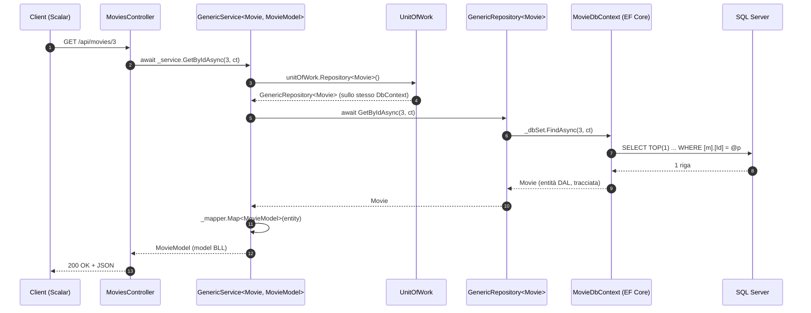
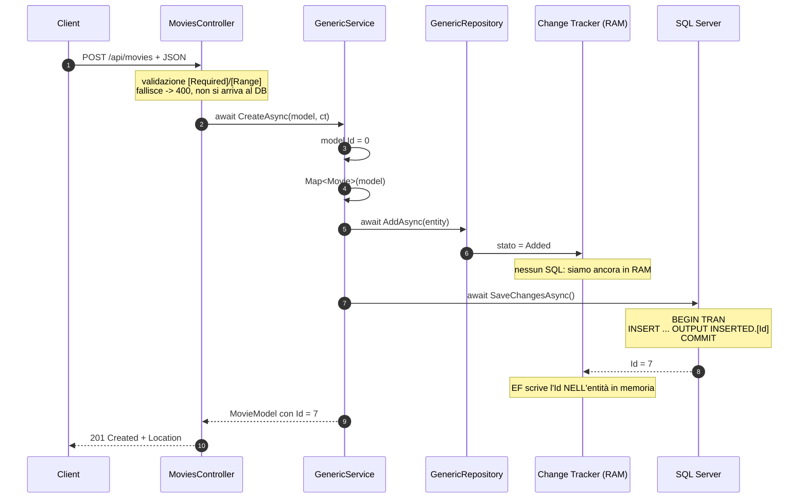

# 12) Dal Controller all'SQL — il flusso completo e i metodi `To*`

[⬅ Torna all'indice](../README.md)

Nei capitoli dall'1 al 9 ho costruito i pezzi uno per uno; nel [capitolo 10](10-database-sql-server.md) ho scritto SQL a mano. Manca la cosa in mezzo, che è anche quella che si capisce peggio: **cosa succede davvero tra la richiesta HTTP e la riga che torna da SQL Server**, e chi trasforma il mio C# in quella `SELECT`.

Questo capitolo segue una richiesta vera dall'inizio alla fine, poi si ferma sulla cerniera fra i due mondi: **quando una query LINQ diventa SQL, e quale metodo la fa partire**. È lì che stanno i metodi `To*` (`ToListAsync`, `ToDictionaryAsync`, `ToArrayAsync`…) e il malinteso più diffuso su EF Core.

> Tutto l'SQL di questo capitolo è **quello vero**, stampato da `ToQueryString()` sul database del progetto. Non è SQL "plausibile": è quello che parte davvero.

---

## 12.1 Il flusso completo di una GET, file per file

Seguo `GET /api/movies/3`. Ogni passaggio è un file che esiste nel progetto.



Passo per passo, con il codice vero:

| # | Dove | Cosa succede |
|---|------|--------------|
| 1 | **Kestrel + routing** | L'URL `/api/movies/3` viene abbinato a `MoviesController.GetById`. Il `3` diventa il parametro `id`, il `CancellationToken` lo inietta ASP.NET ([capitolo 6](06-bll-services.md)) |
| 2 | **`MoviesController`** (PL) | `var model = await _service.GetByIdAsync(id, ct);` — il controller **non sa** che esiste un database |
| 3 | **`GenericService`** (BLL) | chiede il repository alla Unit of Work e gli gira la richiesta |
| 4 | **`GenericRepository`** (DAL) | `_dbSet.FindAsync(...)` — qui finisce il mio codice e comincia EF Core |
| 5 | **EF Core** | traduce in SQL, apre la connessione, manda la query |
| 6 | **SQL Server** | esegue, restituisce le righe |
| 7 | **EF Core** | **materializza**: costruisce un oggetto `Movie` per ogni riga |
| 8 | **`GenericService`** | `_mapper.Map<MovieModel>(entity)` — entità DAL → model BLL |
| 9 | **`MoviesController`** | `return Ok(model)` → ASP.NET serializza in JSON |

Due cose valgono più di tutto il diagramma:

- **Ogni livello parla solo con quello sotto.** Il controller conosce `IGenericService`, non EF Core. Se domani il DAL passasse a PostgreSQL, i passi 1–3 e 8–9 non cambierebbero di una virgola.
- **Il tipo cambia due volte.** JSON → `MovieModel` (model BLL) → `Movie` (entità DAL) → riga SQL, e al ritorno la strada inversa. Sono tre rappresentazioni dello stesso film, ognuna al posto giusto ([capitolo 7](07-plapi-automapper-mapping.md)).

---

## (?) Che cosa è `IQueryable<T>`? (la cosa che confonde di più)

Questa è la chiave di tutto il capitolo.

```csharp
var query = _dbSet.AsNoTracking().Where(m => m.DurationMinutes > 150);
```

Istinto: *"ho appena letto dal database i film lunghi"*. **Falso.** Dopo questa riga **non è partito niente**: nessuna connessione, nessuna `SELECT`, zero millisecondi sul database.

`IQueryable<T>` non è una lista di dati: è la **descrizione di una query**, un albero di espressioni (*expression tree*) che dice *cosa* voglio, senza averlo ancora chiesto a nessuno. È una ricetta, non il piatto.

Questa è la differenza con `IEnumerable<T>`, ed è tutta la partita:

| | `IEnumerable<T>` | `IQueryable<T>` |
|---|---|---|
| Cos'è | dati **già in memoria** | **descrizione** di una query |
| `.Where(...)` | gira in C#, sul processo .NET | diventa una `WHERE` **in SQL** |
| Chi filtra | il mio codice | **SQL Server** |
| Quanti dati arrivano | tutti, poi scarto | solo quelli che servono |

Perché conta davvero:

```csharp
// A) IQueryable: filtra SQL Server. Dal database arrivano 2 righe.
_dbSet.Where(m => m.DurationMinutes > 150).ToList();
//   SELECT ... FROM [Movies] AS [m] WHERE [m].[DurationMinutes] > 150

// B) IEnumerable: ToList() PRIMA. Arrivano tutti i film, poi filtro in C#.
_dbSet.ToList().Where(m => m.DurationMinutes > 150);
//   SELECT ... FROM [Movies] AS [m]        <- tutta la tabella!
```

Su 6 film non se ne accorge nessuno. Su 6 milioni, la **B** trascina l'intera tabella attraverso la rete per buttarne via il 99%. Sono due righe quasi identiche a vedersi, e il `.ToList()` spostato di due parole cambia tutto: **è il punto in cui si passa dal mondo "query" al mondo "dati"**.

Regola: **`ToList()` il più tardi possibile**. Prima si filtra, si ordina e si proietta; solo alla fine si materializza.

---

## 12.2 Esecuzione differita: la query parte solo quando la si consuma

L'`IQueryable` resta una ricetta finché qualcuno non chiede il risultato. Quel qualcuno è un **operatore terminale**, e la maggior parte si chiama `To*`.

```csharp
// 1. costruisco: nessun SQL, nessuna connessione
var query = _dbSet.AsNoTracking()
                  .Where(m => m.DurationMinutes > 150)
                  .OrderByDescending(m => m.DurationMinutes);

// 2. posso ancora aggiungere pezzi: sempre nessun SQL
if (soloInglese) query = query.Where(m => m.Language == "Inglese");

// 3. ORA parte la SELECT, una sola, con dentro TUTTI i pezzi
var film = await query.ToListAsync(ct);
```

Il vantaggio pratico è il punto 2: **la query si compone a pezzi** — filtri opzionali, ordinamenti condizionali — e alla fine EF ne fa **una sola** `SELECT`. Con una `List` in mano non si potrebbe: sarebbe già tutto arrivato.

> ⚠️ **Il tranello dell'esecuzione differita.** Un `IQueryable` si esegue **ogni volta** che lo si consuma. `query.Count()` seguito da `query.ToList()` sono **due** viaggi sul database. E se il `DbContext` è stato chiuso nel frattempo (fuori dallo scope della richiesta), arriva un `ObjectDisposedException`: la ricetta è ancora lì, ma la cucina ha chiuso. È il motivo per cui i repository restituiscono `IReadOnlyList<T>` e **non** `IQueryable<T>`: la query si chiude dentro il DAL, dove il `DbContext` è ancora vivo ([capitolo 4](04-dal-repository-unitofwork.md)).

---

## 12.3 I metodi `To*`: quelli che fanno partire la query

Ecco la famiglia. Sono i metodi che dicono a EF "adesso basta descrivere, vai a prendere i dati".

| Metodo | Restituisce | Quando lo uso |
|--------|-------------|---------------|
| **`ToListAsync()`** | `List<T>` | il caso normale, il 90% delle volte |
| **`ToArrayAsync()`** | `T[]` | quando serve un array fisso; leggermente più economico se non aggiungerò elementi |
| **`ToDictionaryAsync(k => ...)`** | `Dictionary<K,V>` | quando dopo devo **cercare per chiave** tante volte |
| **`ToHashSet()`** | `HashSet<T>` | test di appartenenza rapidi. **Attenzione: gira in memoria** (vedi sotto) |
| **`ToQueryString()`** | `string` | **non esegue niente**: mi mostra l'SQL che partirebbe |
| **`ToListAsync()` su `ProjectTo<T>()`** | `List<TModel>` | proiezione diretta model → SQL (sezione 12.6) |

Tutti hanno la versione sincrona (`ToList`, `ToArray`, `ToDictionary`), che in un'applicazione web **non va usata**: bloccherebbe il thread esattamente come spiegato nel [capitolo 6](06-bll-services.md).

### `ToListAsync` — il caso normale

È quello del repository generico:

```csharp
// MovieManager.DAL/Repositories/GenericRepository.cs
public async Task<IReadOnlyList<T>> GetAllAsync(CancellationToken cancellationToken = default)
    => await _dbSet.AsNoTracking().ToListAsync(cancellationToken);
```

SQL vero generato:

```sql
SELECT [m].[Id], [m].[AgeRating], [m].[Budget], [m].[Country], [m].[DirectorId],
       [m].[DurationMinutes], [m].[GenreId], [m].[Language], [m].[OriginalTitle],
       [m].[PosterUrl], [m].[ReleaseDate], [m].[Revenue], [m].[Synopsis], [m].[Title]
FROM [Movies] AS [m]
```

Da notare: EF **elenca le colonne** invece di fare `SELECT *`. Non è pignoleria — chiede esattamente le colonne che sa mappare, quindi una colonna aggiunta al database e non al modello non rompe niente.

### `ToDictionaryAsync` — quello del seeder

`MovieDbSeeder` lo usa a ogni fase:

```csharp
// MovieManager.DAL/Data/MovieDbSeeder.cs
var existing = await context.Genres.ToDictionaryAsync(g => g.Name, cancellationToken);
```

SQL generato — una `SELECT` normalissima:

```sql
SELECT [g].[Id], [g].[Description], [g].[Name]
FROM [Genres] AS [g]
```

Eseguito davvero sul database del progetto:

```
ToDictionaryAsync() -> 5 chiavi: Fantascienza, Dramma, Thriller, Commedia, Animazione
```

**Il raggruppamento per chiave avviene in memoria, non in SQL.** EF fa una `SELECT` piatta e poi costruisce il `Dictionary` in C#. Ed è esattamente ciò che serve al seeder: carica i generi **una volta**, poi fa decine di `existing.ContainsKey(nome)` senza mai ritornare sul database. Con una `List` ogni controllo sarebbe una scansione; con il `Dictionary` è immediato.

Il perché la chiave sia `g.Name` e non `g.Id` è la logica dell'idempotenza, spiegata nel [capitolo 10](10-database-sql-server.md): l'Id lo assegna il database, il nome no.

> ⚠️ **`ToHashSet()` non ha una versione async, e non è un caso.** Non è un metodo di EF Core: è LINQ normale, e lavora **su dati già in memoria**. Nel seeder infatti compare **dopo** un `ToListAsync`, con le parentesi che fanno tutta la differenza:
>
> ```csharp
> var existing = (await context.MovieActors
>         .Select(ma => new { ma.MovieId, ma.ActorId })
>         .ToListAsync(cancellationToken))    // <- qui finisce SQL
>     .Select(ma => (ma.MovieId, ma.ActorId)) // <- da qui è tutto in RAM
>     .ToHashSet();
> ```
>
> Il primo `.Select` diventa SQL, il secondo gira in C#. `ToListAsync` è il confine.

### `ToQueryString()` — il metodo che ho usato per scrivere questo capitolo

Non esegue niente: restituisce **l'SQL che partirebbe**, come stringa.

```csharp
var query = db.Movies.AsNoTracking().Where(m => m.DurationMinutes > 150);
Console.WriteLine(query.ToQueryString());
```

```sql
SELECT [m].[Id], [m].[AgeRating], ... , [m].[Title]
FROM [Movies] AS [m]
WHERE [m].[DurationMinutes] > 150
```

È **lo strumento** per rispondere alla domanda "ma questa LINQ cosa diventa?" senza indovinare e senza far girare l'app. Funziona solo su un `IQueryable` (su una `List` non esiste: non c'è più nessuna query da mostrare) e non si può usare dopo un terminatore.

L'alternativa a runtime è il log di EF, già attivo nel progetto: avviando l'app ogni query eseguita compare in console ([capitolo 10](10-database-sql-server.md)).

---

## 12.4 I terminatori che **non** si chiamano `To*`

Non tutti gli operatori terminali sono `To*`. Anche questi fanno partire la query, e la fanno partire **subito**:

| Metodo | SQL generato | Restituisce |
|--------|--------------|-------------|
| `FirstOrDefaultAsync(...)` | `SELECT TOP(1) ...` | il primo, o `null` |
| `FirstAsync(...)` | `SELECT TOP(1) ...` | il primo, **eccezione** se non c'è |
| `SingleOrDefaultAsync(...)` | `SELECT TOP(2) ...` | uno solo; **eccezione se ce n'è più d'uno** |
| `CountAsync()` | `SELECT COUNT(*)` | `int` |
| `AnyAsync(...)` | `SELECT CASE WHEN EXISTS (...)` | `bool` |
| `AverageAsync(...)` / `SumAsync(...)` | `SELECT AVG(...)` / `SUM(...)` | il valore |
| `FindAsync(id)` | `SELECT TOP(1) ... WHERE Id = @p` | l'entità, o `null` |

Misurato sul database del progetto:

```
CountAsync()        -> 6
AnyAsync(>170)      -> True
FirstOrDefaultAsync -> Oppenheimer
```

### `SingleOrDefault` prende `TOP(2)`, e il motivo è istruttivo

Sembra uno spreco chiedere due righe per restituirne una. Invece è l'unico modo di **mantenere la promessa**: `Single` garantisce che esista **una sola** riga, e per accorgersi che ce n'è una seconda deve provare a leggerla. Se `TOP(2)` ne riporta due, lancia l'eccezione. È la differenza con `First`, che si accontenta della prima e prende `TOP(1)`.

### ⚠️ `FindAsync` è speciale: può non fare nessuna query

```csharp
// MovieManager.DAL/Repositories/GenericRepository.cs
public async Task<T?> GetByIdAsync(int id, CancellationToken cancellationToken = default)
    => await _dbSet.FindAsync(new object[] { id }, cancellationToken);
```

`FindAsync` guarda **prima nel change tracker**: se l'entità con quell'Id è già stata caricata in questo `DbContext`, la restituisce **senza andare sul database**. Solo se non la trova fa la `SELECT`. Per questo restituisce `ValueTask` e non `Task` — il dettaglio è nel [capitolo 6](06-bll-services.md).

È anche l'unico terminatore che **non** si può comporre: `_dbSet.Where(...).FindAsync(...)` non esiste. `FindAsync` lavora solo per chiave primaria, direttamente sul `DbSet`.

### ⚠️ Una correzione: `AverageAsync` su una colonna `int` **non** tronca

Il [capitolo 10](10-database-sql-server.md) mostra il tranello dell'`AVG` di interi in SQL puro:

```sql
SELECT AVG(Score) FROM Reviews;   -- 8   (la media vera è 8.75!)
```

Verrebbe da pensare che EF, traducendo in `AVG`, si porti dietro lo stesso problema. **Non è così**, e l'ho verificato leggendo l'SQL che EF manda davvero:

```csharp
await db.Reviews.AverageAsync(r => r.Score);
```

```sql
SELECT AVG(CAST([r].[Score] AS float))
FROM [Reviews] AS [r]
```

```
>>> RISULTATO: 8,75  (tipo Double)
```

**EF mette il `CAST` da solo.** Il motivo è che in C# `Average` di una sequenza di `int` restituisce `double` per definizione del linguaggio, e EF deve rispettare quel contratto: quindi converte in `float` **prima** di fare la media, e il troncamento non avviene mai. Il confronto affiancato, sullo stesso database:

| Come | SQL che parte | Risultato |
|------|---------------|-----------|
| `db.Reviews.AverageAsync(r => r.Score)` | `AVG(CAST([r].[Score] AS float))` | **8,75** ✅ |
| `SELECT AVG(Score) FROM Reviews` (a mano) | `AVG(Score)` | **8** ❌ |

Da ricordare al contrario, quindi: **il tranello dell'`AVG` intero è dell'SQL scritto a mano, non di EF**. È uno dei pochi casi in cui l'ORM protegge da un difetto del database invece di nasconderlo.

---

## 12.5 Il catalogo: come LINQ diventa SQL

Tutte queste traduzioni sono verificate con `ToQueryString()` sul database del progetto.

| LINQ | SQL generato |
|------|--------------|
| `.Where(m => m.DurationMinutes > 150)` | `WHERE [m].[DurationMinutes] > 150` |
| `.OrderByDescending(m => m.DurationMinutes)` | `ORDER BY [m].[DurationMinutes] DESC` |
| `.Take(3)` | `SELECT TOP(@p) ...` con `DECLARE @p int = 3;` |
| `.Select(m => new { m.Title, m.DurationMinutes })` | `SELECT [m].[Title], [m].[DurationMinutes]` |
| `.Include(m => m.Genre)` | `INNER JOIN [Genres] AS [g] ON [m].[GenreId] = [g].[Id]` |
| `.GroupBy(m => m.Language).Select(g => new { g.Key, N = g.Count() })` | `SELECT [m].[Language], COUNT(*) GROUP BY [m].[Language]` |
| `.Where(a => a.MovieActors.Any(ma => ma.IsLeadRole))` | `WHERE EXISTS (SELECT 1 FROM [MovieActors] ...)` |
| `.Select(m => new { m.Title, Genere = m.Genre.Name })` | `INNER JOIN [Genres]` + due sole colonne |

Le più interessanti, per esteso.

**`Select` di proiezione — solo le colonne che servono:**

```csharp
db.Movies.Select(m => new { m.Title, m.DurationMinutes })
```
```sql
SELECT [m].[Title], [m].[DurationMinutes]
FROM [Movies] AS [m]
```

Due colonne su quattordici. È lo stesso principio del `SELECT Title, ReleaseDate` invece di `SELECT *` del [capitolo 10](10-database-sql-server.md), ottenuto scrivendo C#.

**`Any` diventa `EXISTS` — non una JOIN:**

```csharp
db.Actors.Where(a => a.MovieActors.Any(ma => ma.IsLeadRole))
```
```sql
SELECT [a].[Id], [a].[Biography], [a].[BirthDate], [a].[Country], [a].[FirstName], [a].[LastName]
FROM [Actors] AS [a]
WHERE EXISTS (
    SELECT 1
    FROM [MovieActors] AS [m]
    WHERE [a].[Id] = [m].[ActorId] AND [m].[IsLeadRole] = CAST(1 AS bit))
```

È **esattamente** il `NOT EXISTS` scritto a mano nella sezione 10.8, `SELECT 1` compreso. Chi ha imparato l'SQL riconosce il proprio pensiero tradotto; chi conosce solo LINQ ora sa cosa sta chiedendo al database. Da notare anche `CAST(1 AS bit)`: in C# è `bool`, in SQL Server è `bit`, e la conversione la fa EF.

**Navigare una proprietà genera la JOIN da sola:**

```csharp
db.Movies.Select(m => new { m.Title, Genere = m.Genre.Name })
```
```sql
SELECT [m].[Title], [g].[Name] AS [Genere]
FROM [Movies] AS [m]
INNER JOIN [Genres] AS [g] ON [m].[GenreId] = [g].[Id]
```

Ho scritto `m.Genre.Name` — un accesso a una proprietà — ed è uscita una JOIN con due sole colonne. Questo è l'ORM al suo meglio: la relazione dichiarata nel [capitolo 3](03-dal-dbcontext.md) diventa navigabile come un oggetto, e la JOIN la scrive EF.

**`Take` usa un parametro, non un letterale:**

```sql
DECLARE @p int = 3;
SELECT TOP(@p) ... ORDER BY [m].[DurationMinutes] DESC
```

Il `3` non finisce dentro la stringa SQL: diventa `@p`. È lo stesso meccanismo dei parametri visto nella sezione 10.11, quello che rende impossibile la SQL injection — e in più permette a SQL Server di **riusare il piano di esecuzione** per `Take(3)` e `Take(50)`.

---

## 12.6 `ProjectTo<T>()` — il `To` che questo progetto non usa (e quando servirebbe)

Oggi il `GenericService` fa così:

```csharp
var entities = await _repository.GetAllAsync(cancellationToken);   // 1. SELECT di tutto
return _mapper.Map<IReadOnlyList<TModel>>(entities);               // 2. mapping in RAM
```

Due fasi separate: EF carica **entità intere**, poi AutoMapper le converte in model. `ProjectTo<T>()` fa le due cose insieme — traduce il **mapping stesso** in `SELECT`, chiedendo al database solo le colonne che il model userà.

La differenza si vede solo quando il model è **più magro** dell'entità. Con un `MovieListItem` di tre campi:

```csharp
public class MovieListItem
{
    public string Title { get; set; }
    public int DurationMinutes { get; set; }
    public string GenreName { get; set; }   // <- Movie.Genre.Name, appiattito
}
```

**A) `Include` + `Map` (l'approccio a due fasi):**

```sql
SELECT [m].[Id], [m].[AgeRating], [m].[Budget], [m].[Country], [m].[DirectorId],
       [m].[DurationMinutes], [m].[GenreId], [m].[Language], [m].[OriginalTitle],
       [m].[PosterUrl], [m].[ReleaseDate], [m].[Revenue], [m].[Synopsis], [m].[Title],
       [g].[Id], [g].[Description], [g].[Name]
FROM [Movies] AS [m]
INNER JOIN [Genres] AS [g] ON [m].[GenreId] = [g].[Id]
```

**B) `ProjectTo<MovieListItem>()`:**

```csharp
var q = db.Movies.AsNoTracking().ProjectTo<MovieListItem>(config);
```
```sql
SELECT [m].[Title], [m].[DurationMinutes], [g].[Name] AS [GenreName]
FROM [Movies] AS [m]
INNER JOIN [Genres] AS [g] ON [m].[GenreId] = [g].[Id]
```

**17 colonne contro 3**, stesso risultato. E c'è una finezza: non ho scritto da nessuna parte che `GenreName` viene da `Genre.Name`. Lo ha dedotto AutoMapper per **convenzione di appiattimento** (`GenreName` → `Genre` + `Name`) e ha generato la JOIN da solo.

> **Perché allora il progetto non lo usa?** Perché qui non servirebbe a niente, e vale la pena essere onesti: i model del [capitolo 5](05-bll-models.md) rispecchiano le entità **campo per campo**. Provato davvero, `ProjectTo<MovieModel>()` genera le stesse identiche 14 colonne di `ToListAsync()` + `Map`: zero guadagno, in cambio di una dipendenza da AutoMapper dentro il DAL — cioè proprio il livello che il [capitolo 9](09-plapi-program-di-scalar.md) tiene pulito. `ProjectTo` diventa la scelta giusta il giorno in cui comparisse un vero DTO di elenco (una griglia "titolo + genere + regista"), e allora il posto giusto per usarlo sarebbe un repository che restituisce `IQueryable`, con tutti i distinguo della sezione 12.2.

`ProjectTo` è un `To` a tutti gli effetti, ma di un tipo diverso dagli altri: **non esegue la query**, la *trasforma*. Restituisce ancora un `IQueryable<TModel>`, e il terminatore va messo dopo (`await q.ToListAsync()`).

---

## 12.7 Tracking e `AsNoTracking`: cosa cambia nell'SQL (niente) e in RAM (molto)

```csharp
_dbSet.AsNoTracking().ToListAsync()   // GetAllAsync, FindAsync
_dbSet.FindAsync(id)                  // GetByIdAsync -> TRACCIA
```

Fatto che sorprende: **l'SQL è identico**. `AsNoTracking()` non cambia una virgola della `SELECT`. Cambia cosa EF fa **dopo** aver ricevuto le righe:

| | Con tracking (default) | Con `AsNoTracking()` |
|---|---|---|
| SQL | identico | identico |
| Dopo la materializzazione | tiene una **copia** di ogni entità per accorgersi delle modifiche | butta via tutto |
| Memoria | doppia | singola |
| `SaveChanges()` vede le modifiche? | **sì** | **no** |
| Identità | due query sullo stesso Id danno **lo stesso oggetto** | danno **due oggetti diversi** |

Da qui la scelta del repository, che ora si legge da sola:

- `GetAllAsync` / `FindAsync` → **sola lettura**, i dati escono verso il controller e nessuno li modificherà: `AsNoTracking()`.
- `GetByIdAsync` → usa `FindAsync`, che **traccia**. È voluto: il `GenericService` lo chiama dentro `UpdateAsync` e `DeleteAsync` proprio per poi modificare o cancellare l'entità ([capitolo 6](06-bll-services.md)).

> ⚠️ **Il bug che nasce da qui.** Se `GetByIdAsync` usasse `AsNoTracking()`, `UpdateAsync` smetterebbe di funzionare **in silenzio**: `_mapper.Map(model, existing)` modificherebbe un oggetto che EF non sta guardando, `SaveChangesAsync` non troverebbe niente da salvare e restituirebbe `0`. Nessuna eccezione, nessun errore, la `PUT` risponderebbe `204` e il dato non cambierebbe. È il tipo di bug peggiore: quello che non si lamenta.

---

## 12.8 Il flusso di una POST: dove nasce l'`INSERT`

Il percorso di scrittura ha una forma diversa, e il punto interessante è **quanto tardi** parte l'SQL.

```csharp
// MovieManager.BLL/Services/GenericService.cs
public async Task<TModel> CreateAsync(TModel model, CancellationToken cancellationToken = default)
{
    model.Id = 0;                                           // 1. in RAM
    var entity = _mapper.Map<TEntity>(model);               // 2. in RAM
    await _repository.AddAsync(entity, cancellationToken);  // 3. in RAM: solo change tracker
    await _unitOfWork.SaveChangesAsync(cancellationToken);  // 4. <- QUI parte l'INSERT
    return _mapper.Map<TModel>(entity);                     // 5. rileggo l'Id generato
}
```



I tre punti che raccontano l'architettura:

1. **`AddAsync` non tocca il database.** Marca l'entità come `Added` nel change tracker e basta. Il perché ne esista una versione async è nel [capitolo 6](06-bll-services.md) — e la risposta è che qui non serviva.
2. **`SaveChangesAsync` è il momento della verità**, ed è **una transazione** ([capitolo 10](10-database-sql-server.md)). Tutto quello che si è accumulato parte insieme; se una cosa fallisce, non ne resta traccia. È **il** motivo per cui la Unit of Work esiste e per cui il `SaveChanges` sta nel service.
3. **L'`Id` torna indietro da solo.** `INSERT ... OUTPUT INSERTED.[Id]` fa restituire a SQL Server l'Id appena generato nella stessa andata e ritorno; EF lo scrive **dentro l'oggetto `entity`** che ho in mano. Per questo il passo 5 può rimappare la stessa `entity` e trovarci l'Id, senza una `SELECT` in più. È anche il motivo per cui il passo 1 (`model.Id = 0`) è indispensabile: il dettaglio, con l'errore 544, sta nel [capitolo 6](06-bll-services.md).

---

## 12.9 ⚠️ La conseguenza nascosta: la POST può mentire

Il punto 3 qui sopra — *"l'Id torna indietro da solo"* — nasconde un difetto che ho scoperto solo misurandolo, ed è il più istruttivo di tutto il capitolo. Rileggiamo l'ultima riga:

```csharp
await _unitOfWork.SaveChangesAsync(cancellationToken);
return _mapper.Map<TModel>(entity);      // <- rimappa l'entità IN MEMORIA
```

`entity` è l'oggetto che ho costruito **io** e passato a EF. Dopo l'`INSERT`, EF ci scrive dentro **solo l'Id** (è tutto ciò che `OUTPUT INSERTED.[Id]` riporta indietro). **Tutto il resto è rimasto quello che avevo mandato**, non quello che il database ha effettivamente scritto.

Se il database *trasforma* un valore mentre lo salva, l'oggetto in memoria non se ne accorge. E `Budget` è `decimal(18,2)`, cioè due decimali. Provato sull'app vera:

| Passo | Valore |
|-------|--------|
| 1. Il client invia `budget` | `123.456789` |
| 2. La **POST risponde** | `123.456789` |
| 3. Nel **database** c'è | **`123.46`** |
| 4. Una **GET** successiva dice | **`123.46`** |

**La `POST` ha dichiarato al client un valore che il database non contiene**, e la `GET` subito dopo lo smentisce. Non c'è nessun errore, nessun warning: due risposte della stessa API si contraddicono. Dal punto di vista REST è un difetto vero — un `201 Created` dovrebbe restituire la rappresentazione della risorsa **creata**, non di quella che avevo chiesto di creare.

Vale per tutto ciò che il database decide al posto mio: arrotondamenti dei `decimal`, valori di `DEFAULT`, colonne calcolate, trigger.

La correzione sarebbe una riga, ricaricare l'entità dopo il salvataggio:

```csharp
await _unitOfWork.SaveChangesAsync(cancellationToken);
await _context.Entry(entity).ReloadAsync(cancellationToken);   // rilegge dal database
return _mapper.Map<TModel>(entity);
```

**Il progetto non la fa**, ed è una scelta consapevole con un prezzo da entrambi i lati: il `Reload` costa una `SELECT` in più su **ogni** create — proprio la `SELECT` che `OUTPUT INSERTED.[Id]` era stato progettato per evitare — in cambio di una correttezza che, con budget di film, non si nota mai. In un dominio dove il database trasforma davvero i dati (importi, `DEFAULT`, colonne calcolate) la scelta si ribalta e il `Reload` diventa obbligatorio.

> La lezione generale è più grande del bug: **l'oggetto in memoria e la riga sul database sono due cose diverse**, e dopo un `INSERT` coincidono solo per quello che EF si è fatto restituire. È lo stesso equivoco del tracking (sezione 12.7), visto dall'altra parte.

---

## 12.10 Le altre due trappole

### N+1: una query che diventa mille

```csharp
var movies = await db.Movies.ToListAsync();       // 1 query
foreach (var m in movies)
    Console.WriteLine(m.Genre?.Name);             // N query... o null
```

Il classico dei classici con gli ORM: si carica una lista e poi, dentro un ciclo, si tocca una proprietà di navigazione. Con il **lazy loading** attivo partirebbe una `SELECT` per ogni film: 6 film = 7 query, 6000 film = 6001.

**In questo progetto il lazy loading non è attivo** (manca il pacchetto `Microsoft.EntityFrameworkCore.Proxies` e le navigazioni non sono `virtual`), quindi l'N+1 non può nemmeno succedere: `m.Genre` è semplicemente `null`. È un default fortunato — il problema si manifesta come dato mancante invece che come lentezza misteriosa, ed è molto più facile da vedere.

La soluzione, quando servirà davvero il genere: **`Include`** (una query con JOIN) oppure **`Select`/`ProjectTo`** (una query con le sole colonne utili).

### Client evaluation: quando EF si arrende

```csharp
db.Movies.Where(m => DecidiIo(m.Title))   // metodo C# mio: EF non sa tradurlo in SQL
```

EF Core sa tradurre `Where`, `Select`, `Any`... ma non un metodo C# scritto da me. Nelle prime versioni di EF Core, in questi casi scaricava **tutta la tabella** e filtrava in memoria — silenziosamente. Dalla 3.0 il comportamento è cambiato e ora **lancia un'eccezione**:

```
The LINQ expression '...' could not be translated.
```

È una delle migliori decisioni di design di EF Core: meglio un errore chiaro in faccia che un'app che funziona benissimo con 6 film e crolla con 6 milioni. Se il filtro in memoria lo voglio davvero, devo dirlo esplicitamente con un `AsEnumerable()`, che è il confine dichiarato fra i due mondi.

---

## Verifica finale

Le domande a cui questo capitolo deve saper rispondere:

1. **Dopo `var q = _dbSet.Where(...)`, quante query sono partite?** Zero. `q` è una descrizione.
2. **Chi fa partire la query?** Un terminatore: `ToListAsync`, `FirstOrDefaultAsync`, `CountAsync`, `AnyAsync`, `FindAsync`…
3. **Dove va messo il `ToList()`?** Il più tardi possibile: prima si filtra in SQL, poi si materializza.
4. **Che SQL fa questa LINQ?** `ToQueryString()`, oppure il log di EF in console.
5. **`AsNoTracking()` cambia l'SQL?** No. Cambia solo cosa EF tiene in memoria dopo.
6. **`AverageAsync` su un `int` tronca?** No: EF fa il `CAST(... AS float)` da solo. Tronca l'`AVG` scritto a mano.
7. **Quando parte l'`INSERT` di una POST?** In `SaveChangesAsync`, non in `AddAsync`.
8. **Quello che la POST restituisce è quello che c'è nel database?** **No.** Solo l'`Id` torna indietro; il resto è l'oggetto che avevo mandato (sezione 12.9).

Per provarle da soli basta avviare l'app e guardare la console: ogni query eseguita viene stampata con il suo SQL.

[➡ Prossima parte: Le migration — versionare lo schema del database](13-migrations.md)
